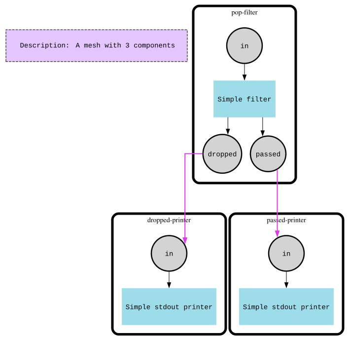

# Filter

This example demonstrates signal filtering by labels. It models a song filter: a stream of songs, each carrying `genre`/`artist`/`year` labels, is checked against a set of disallowed labels. Signals matching a disallowed label are dropped; everything else passes through.

## How it works

- **`pop-filter`** — input `in`, outputs `dropped` and `passed`. It's built with a set of disallowed labels (here, `genre=pop`). For each incoming signal it checks the signal's labels against the disallowed set: a match rewrites the payload to a `"DROPPED: ..."` message and sends it out `dropped`; anything else is forwarded unchanged out `passed`.
- **`dropped-printer`** and **`passed-printer`** — each a single-input (`in`) stdout printer that prints every signal it receives, prefixed with its own component name.

Wiring: `pop-filter.dropped → dropped-printer.in` and `pop-filter.passed → passed-printer.in`, all added to one mesh (`demo-filter`) with `fmesh.WithErrorHandlingStrategy(fmesh.StopOnFirstErrorOrPanic)`. Nine songs are loaded onto `pop-filter`'s `in` port as a `signal.Group` before the mesh runs.

Notable APIs: `meta.NewLabels()` to build a labeled rule set and `Labels.ForEach`/`signal.Labels().ValueIs` to match against it, `signal.MapPayload` to transform a signal's payload while routing it, and `signal.NewGroup().With(...)` to seed multiple labeled signals onto one input port at once.



## Run

```bash
go run .
```

Set `FMESH_GRAPH=1 go run .` to regenerate `demo-filter-graph.dot` and `demo-filter-graph.svg` instead of running the mesh.
