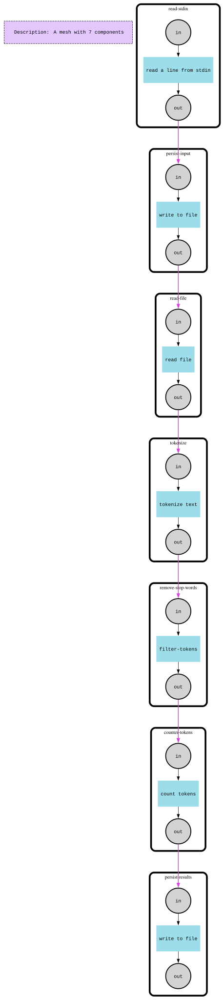

# Pipeline

This example teaches the linear chain: a fixed sequence of components, each with a single `in` and a single `out` port, piped one-to-the-next so a signal moves through the mesh in stages. It models a small text-processing pipeline: text typed at the console is written to a file, read back, tokenized, filtered, counted, and the counts are written to a result file — mirroring how a real batch job might round-trip data through disk between stages.

As the banner puts it: `stdin → persist input → file reader → tokenizer → stop-word filter → counter → persist results`.

## How it works

Seven components, each built with one `in` input and one `out` output, wired stage 1 → 2 → ... → 7 via `OutputByName("out").PipeTo(InputByName("in"))`:

1. **read-stdin** — prompts "Please input text and press ENTER" and reads one line from stdin.
2. **persist-input** — writes the line to a file named `stage-<N>_<component>_<unixnano>` and outputs the filename.
3. **read-file** — opens that file (via `os.OpenRoot`) and outputs its full contents as one signal.
4. **tokenize** — splits the text on spaces and emits one signal per token.
5. **remove-stop-words** — drops tokens in a block list (`yes`, `no`), rebuilding the group with `signal.NewGroup()`.
6. **counter-tokens** — counts occurrences per token and emits `token:count` signals.
7. **persist-results** — writes the count signals to another `stage-<N>_...` file.

Notable f-mesh APIs: components carry a `"stage"` label (`Labels().Set`/`ValueIs`) so `main` can locate stage 1 to seed it and the last stage to read its result, rather than holding direct references. The mesh runs with `fmesh.WithErrorHandlingStrategy(fmesh.StopOnFirstErrorOrPanic)`, and stages read/write signals with `Signals().FirstPayloadOrDefault`, `Signals().ForEach`, `PutSignals`, and `PutSignalGroups`. `main` triggers the pipeline by putting a signal on stage 1's input, then calls `fm.Run(context.Background())`.



## Run

```bash
go run .
```

You'll be prompted to type a line of text and press Enter; the pipeline reads it from stdin. It also writes and reads intermediate files (`stage-<N>_<component>_<timestamp>`) in the current directory as it runs.

Set `FMESH_GRAPH=1` to regenerate `demo-pipeline-graph.dot`/`.svg` instead of running the pipeline:

```bash
FMESH_GRAPH=1 go run .
```
