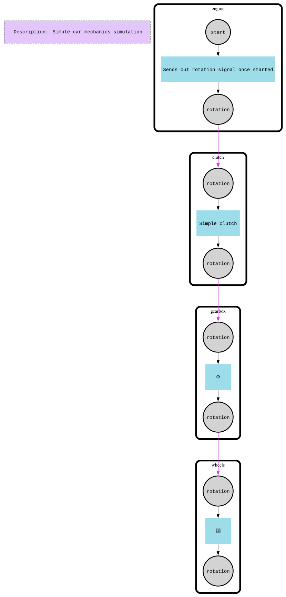

# Graphviz

This example teaches how to export an f-mesh's topology to DOT/SVG using [`github.com/hovsep/fmesh-graphviz`](https://github.com/hovsep/fmesh-graphviz), and how to render each activation cycle as its own graph with the components that fired highlighted.

It runs a small car drivetrain mesh, then exports it twice: once as a static graph (topology only) and once per activation cycle (topology plus which components activated).

## How it works

The mesh models a drivetrain chain: `engine -> clutch -> gearbox -> wheels`. Starting the engine sends a rotation signal down the chain each cycle; the gearbox halves the rotation value before forwarding it to the wheels.

After `fm.Run(...)` completes, the example builds a `dot.NewDotExporter()` and:

- calls `exporter.Export(fm)` for a static DOT graph of the topology, written to `static_graph-<id>.dot`
- calls `exporter.ExportWithCycles(fm, runtimeInfo.Cycles)` to get one DOT graph per activation cycle, each with the activated components highlighted, written to `cycle#<n>-<id>.dot`

Separately, `internal.HandleGraphFlag` (shared by every example via `FMESH_GRAPH=1`) exports the mesh's static topology and, if the `dot` binary is on `PATH`, converts it to `graph-graph.svg` — the image below.



## Run

```bash
go run .

# Also generate graph-graph.dot / graph-graph.svg via internal.HandleGraphFlag
FMESH_GRAPH=1 go run .
```

Every run also writes the static and per-cycle `.dot` files described above into the current directory. To convert all of them to images:

```bash
for f in *.dot; do dot -Tpng "$f" -o "${f%.dot}.png"; done
```
