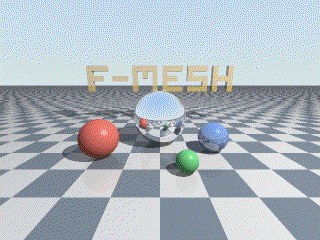

# Ray Tracer

A 3D animation — one camera orbit around a small ray-traced scene (a mirror sphere, a few matte and glossy spheres, golden "F-MESH" lettering floating over a checkerboard floor) — rendered by a mesh in which every render function is a component. 36 frames at 320x240 with 2x2 supersampling, shadows and up to 3 reflection bounces, written to `out.gif`.



This is *wavefront ray tracing* — the architecture real GPU path tracers use. Instead of a recursive `trace()` call, rays travel in per-tile waves, and the reflection recursion becomes a mesh cycle: the shader pipes the reflected wave back into its chain's intersector, each ray carrying the weight of its remaining contribution, until `MaxBounces` is reached.

F-Mesh concepts demonstrated:

1. **Fan-out parallelism** — four `raygen -> intersector -> shadow-caster -> shader` chains render horizontal tile bands concurrently (components of a cycle activate in parallel goroutines).
2. **Recursion as a feedback loop** — the shader's secondary output pipes reflected waves back into its intersector (the wavefront reflection cycle).
3. **Fan-in** — all shaders feed one accumulator port; all chains feed one downsampler port.
4. **Scalars** — routing metadata (`frame`, `y_from`, `bounce`) rides on signals as native numeric metadata; `MapPayload(s)` preserves it, so pure stages never touch it. There are no custom "message" structs.
5. **Config as data flow** — the scene is not shared state: the scene source derives per-concern signals from it (geometry, light) and each tracing component adopts a private copy of only the data it needs.
6. **Cycle barrier** — the assembler naively merges whatever tiles arrived, because a cycle only ends when every component has finished.
7. **Feedback-driven animation** — the assembler requests the next frame from the orbit; there is no rendering loop in `main()`.
8. **Observers** — the progress component reports from scalars alone, payload-agnostic.

## How it works

The code is grouped by pipeline role. The pure 3D math (vectors, camera, scene, shading) lives in [`render`](./render) and knows nothing about F-Mesh; start reading with [`main.go`](./main.go) and [`mesh.go`](./mesh.go), which wire everything below together.

### Setup — [`setup`](./setup)

- **scene** — the mesh's single entry point. On kick-off it builds the scene and emits per-concern config signals: geometry to every intersector and shadow-caster, the light to every shadow-caster and shader. These one-off signals arrive on the very first cycle, before any wave of rays; each component adopts its own private copy, so no pointer is shared. It then forwards the kick-off to the orbit.
- **orbit** — for every requested frame number, emits the viewpoint on the camera's orbit around the scene. Once all frames are rendered it emits nothing, so the mesh naturally comes to a halt.
- **camera-builder** — a pure mapping stage turning a viewpoint into a camera basis.
- **director** — splits each frame into horizontal tiles, one per parallel tracing chain, tagging each tile signal with `frame`, `y_from` and `y_to` scalars.

### Tracing — [`tracing`](./tracing)

Four parallel chains (one per tile band), each `raygen -> intersector -> shadow-caster -> shader`:

- **raygen** — turns a tile into the primary wave of rays (bounce 0, weight 1), several samples per pixel for antialiasing.
- **intersector** — intersects a wave of rays with the geometry. It receives both the primary wave from its raygen and the reflected waves looped back from its shader.
- **shadow-caster** — fires a shadow ray from every hit towards the light and marks the hits which actually see it.
- **shader** — converts hits into weighted color contributions and, for reflective hits, spawns the secondary wave that loops back into the chain's intersector with `bounce+1`. While `bounce < MaxBounces` it always emits the secondary wave — even an empty one — so every tile produces a deterministic number of waves.
- **accumulator** — stateful fan-in point: sums the contribution waves per tile and, when the tile's last wave (`bounce == MaxBounces`) arrives, releases the finished samples downstream.

### Imaging — [`imaging`](./imaging)

- **downsampler** — averages the supersampled colors down to one color per pixel.
- **gamma** — clamps linear colors and applies gamma correction.
- **packer** — packs colors into raw RGBA bytes.
- **assembler** — merges the tiles of a frame (all of them arrive in the same cycle, thanks to the cycle barrier), emits the finished frame, reports progress, and asks the orbit for the next frame — the feedback pipe that drives the whole animation, keeping exactly one frame in flight.

### Output — [`output`](./output)

- **palettizer** — converts RGBA frames to GIF's indexed color space with Floyd–Steinberg dithering. It works pipelined: while it dithers frame N, the chains are already busy with frame N+1.
- **encoder** — accumulates paletted frames in its state and writes `out.gif` once the last frame arrives.
- **progress** — sits aside of the main flow and logs `rendered frame N/36` from the signal's scalars alone.

Shared port names, scalar names and frame parameters live in [`common`](./common).


## Run

```bash
go run .

# export the mesh topology as DOT/SVG instead of rendering
FMESH_GRAPH=1 go run .
```

Renders the animation and writes `out.gif` to the current directory, logging progress per frame. With `FMESH_GRAPH=1` it writes `ray tracer-graph.dot` (and `.svg` if graphviz is installed) and exits.
