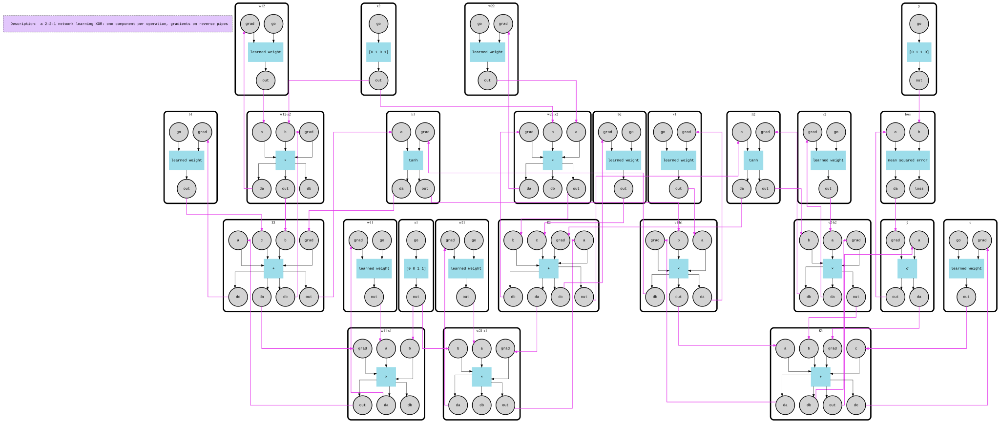

# Auto-diff

Backpropagation the way the textbook draws it, except the drawing runs. The mesh **is** the computation graph of a tiny neural network: one component per operation, values flowing forward through one set of pipes and gradients flowing back through another. Nothing outside the mesh knows the chain rule.

The network has two hidden neurons and learns XOR, the classic problem no single neuron can solve:

```
h1   = tanh(w11·x1 + w12·x2 + b1)
h2   = tanh(w21·x1 + w22·x2 + b2)
ŷ    = σ(v1·h1 + v2·h2 + c)
loss = mean((ŷ - y)²)
```

```
  epoch    1  loss 0.25952
  epoch  500  loss 0.01201
  ...
  epoch 3000  loss 0.00067

  x1 x2 │ XOR │ network
   0  0 │  0  │ 0.023
   0  1 │  1  │ 0.970
   1  0 │  1  │ 0.971
   1  1 │  0  │ 0.020
```

## How it works

25 components: 3 data leaves (`x1`, `x2`, `y`), 9 learned parameters, 12 operations (`×`, `+`, `tanh`, `σ`) and the `loss`.

- **Forward.** Each operation waits for all its inputs (`component.RequireInputs`), computes its value, keeps inputs and value in its `State()` for later, and sends the value on. The four XOR cases travel together as one vector, so one run is one epoch.
- **Backward.** For every input `a`, `b`, `c` an operation has a gradient output `da`, `db`, `dc`, piped back to the `grad` port of whoever produced that input. The `loss` ends the forward pass by sending its own gradient back, and the backward wave runs through the mesh in reverse. Each operation knows only its local derivative (`d(a·b)/da = b`, `d tanh = 1 - y²`); the chain rule is the wiring.
- **Gradients add up where values fan out.** A value used by several nodes gets a gradient from each. A node counts the pipes on its own output (`OutputByName("out").Pipes().Len()`), waits until that many gradients have arrived, and sums them.
- **The optimiser lives in the leaves.** A parameter that receives its gradient takes a gradient-descent step on its own state. A training step from `main` is just "put a `go` on every leaf and `Run`": forward pass, backward pass and update all happen inside one run.
- **Tested against the definition of a derivative.** `main_test.go` nudges each weight, measures how the loss moves (finite differences, with an independent plain-Go copy of the network), and checks every gradient the mesh computed.



## Run

```bash
go run .

# Regenerate the graph files (autodiff-graph.dot / .svg)
FMESH_GRAPH=1 go run .
```
