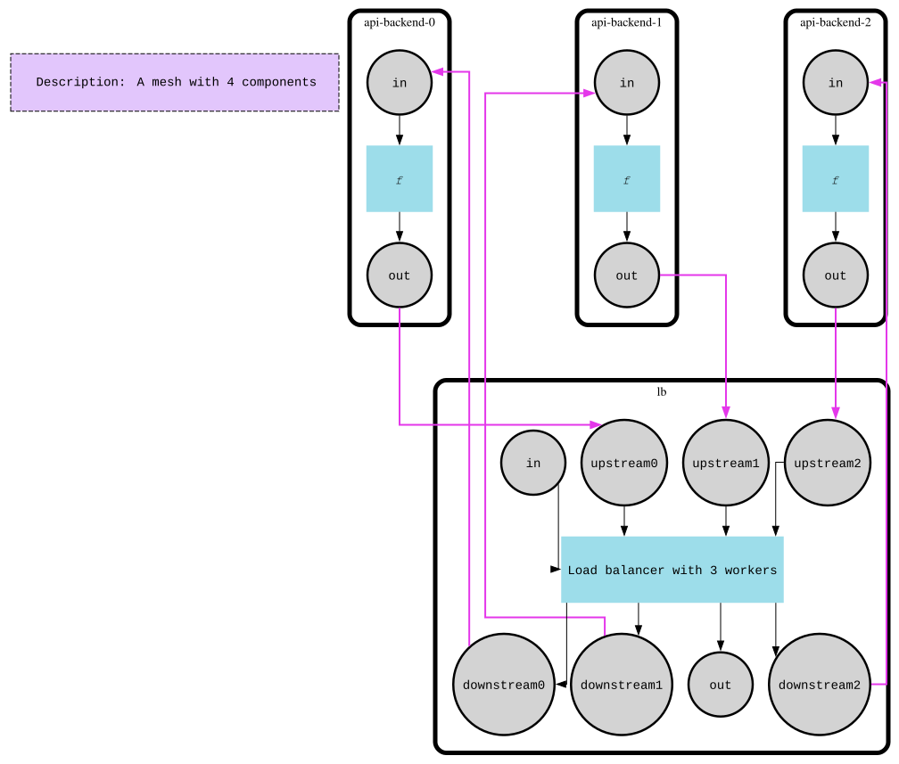

# Load Balancer

This example teaches indexed ports and per-component state: a component can expose a whole numbered family of inputs/outputs (`upstream0..N`, `downstream0..N`) instead of one fixed pair, and can carry state across activations to remember where it left off — here, which worker gets the next request.

The scenario is a round-robin load balancer in front of `N` workers. Each wave of incoming requests is distributed across the workers in rotation, one request after another, and the workers' responses are forwarded back out through a single shared output.

## How it works

- **`lb`** component — input `in`, output `out`, plus indexed ports `upstream0..upstream{N-1}` and `downstream0..downstream{N-1}` (one pair per worker). Its initial state stores `workers_number`; each activation reads back `last_worker_index` from state, routes every signal on `in` to `downstream{lastWorkerIndex}` in turn (wrapping with `%= workersNum`), then advances and saves the index back into state for the next activation. It also forwards anything arriving on the `upstream` ports straight out to `out` via `port.ForwardSignals`.
- **`api-backend-0..2`** — three worker components (input `in`, output `out`). On activation each just stamps its own name onto the request payload and replies on `out`.
- Wiring: `lb`'s `downstream{i}` is piped to worker `i`'s `in`, and worker `i`'s `out` is piped back to `lb`'s `upstream{i}`.
- The mesh runs multiple waves; each wave pushes a batch of request signals onto `lb`'s `in` port and calls `fm.Run` once per wave, then reads the collected responses off `lb`'s `out`.
- Notable APIs: `component.WithIndexedInputs` / `component.WithIndexedOutputs`, `component.WithInitialState`, `this.State().Get` / `GetOrDefault` / `Set` for state carried between activations, and `port.ForwardSignals`.



## Run

```bash
go run .
```

Set `FMESH_GRAPH=1` to regenerate the graph files (`demo-load-balancing-graph.dot` / `demo-load-balancing-graph.svg`) instead of running the simulation:

```bash
FMESH_GRAPH=1 go run .
```
