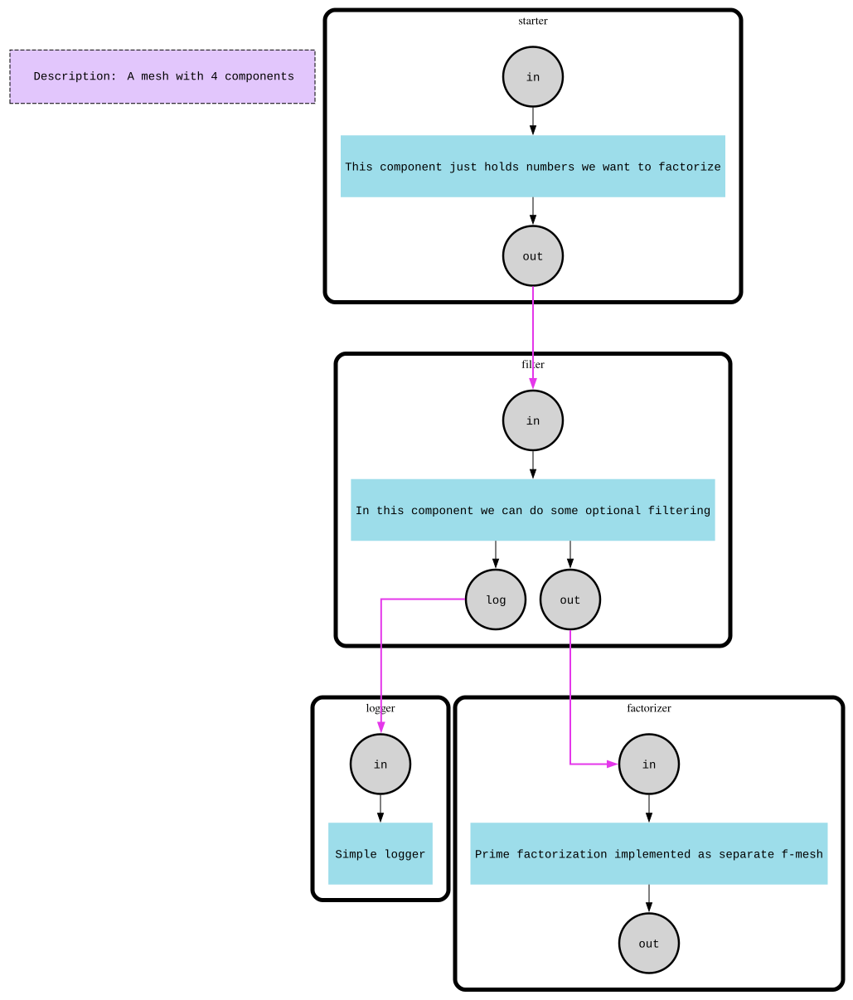

# Nesting

This example teaches composition: a component whose activation function builds and runs a whole inner f-mesh, rather than doing its work inline. The outer mesh doesn't know or care that `factorizer` is itself a mesh — it just sees an ordinary component with one input and one output.

The scenario is prime factorization. The outer mesh takes a number (315), filters out anything too large to handle, and hands the rest to `factorizer`. Each time `factorizer` activates, it builds a fresh "prime factors algo" mesh, feeds the number into it, runs it to completion, and reads back the collected factors before emitting them on its own output port.

## How it works

- **Outer mesh** (`outer`): `starter` → `filter` → `factorizer`, with `filter` also branching a `log` output to `logger`.
  - `starter` just forwards the input number.
  - `filter` accepts numbers under 1000 on `out`; anything else goes to `log` instead.
  - `logger` prints whatever lands on `log`.
  - `factorizer` is the composition boundary: on each activation it calls `getPrimeFactorizationMesh()` to construct the inner mesh, pushes the incoming signal onto the inner mesh's `starter` input, calls `Run()` on it synchronously, and reads the inner mesh's `results` output before putting a `factorizedNumber{Num, Factors}` signal on its own `out` port.
- **Inner mesh** ("prime factors algo"): `starter` → `d2` → `dodd` → `final_prime`, each of `d2`/`dodd`/`final_prime` also emitting factors onto a shared `factor` port that fans into `results`, which forwards them to its `factors` output.
  - `d2` strips even factors, `dodd` strips odd factors from 3 upward, and `final_prime` catches any prime remainder greater than 1.

Signals cross the outer/inner boundary manually inside `factorizer`'s activation function — there's no pipe between the two meshes; instead the code calls `PutSignals` on the inner mesh's input port and reads `Signals().AllPayloads()` off its output port after `Run()` returns. Notable APIs: `component.WithActivationFunc` building and driving a nested `fmesh.FMesh`, `port.ForwardSignals`, and `fmesh.WithErrorHandlingStrategy(fmesh.StopOnFirstErrorOrPanic)` on both meshes.



## Run

```bash
go run .

# Regenerate outer-graph.dot / outer-graph.svg
FMESH_GRAPH=1 go run .
```
