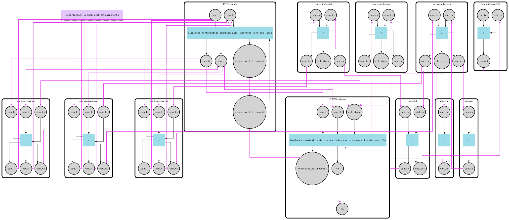

# Advanced CAN Bus

This example simulates a full CAN protocol stack: a laptop plugged into a car's OBD-II socket sends diagnostic requests over a powertrain CAN bus to two ECUs, and their responses flow back the same way. Unlike the [basic](../basic) version, nothing here is a simple fan-out — frames are encoded down to individual bits, bits become differential voltages on a pair of wires, and nodes compete for the bus through real arbitration. CAN frames omit CRC and ACK fields, but essential behaviors — bit stuffing, arbitration, and wired-AND logic — are implemented.

On the f-mesh side it shows how far component composition scales: every node is three chained components, all nodes run concurrently without a single explicit goroutine, the bus keeps itself alive with self-activation feedback pipes, the controller is a stateful finite state machine advanced one bit per mesh cycle, and the whole simulation halts naturally when a watchdog component stops feeding the loop. The architecture is modular: you can add more nodes, noise generators, or virtual instruments (e.g. a voltmeter to plot bus waveforms).

## How it works

### The bus (`can/bus`)

- **Wires** (`wires.go`) — simulates the differential pair `CAN_H`/`CAN_L`. Each cycle it collects the voltages driven by every transceiver, validates them (no missing or out-of-range voltages, L never above H), and resolves the bus level with wired-AND logic, approximated as `min(CAN_L)` / `max(CAN_H)` across all nodes — so any node driving dominant wins over recessive. On startup it seeds itself with 11 recessive bits (EOF + IFS + 1) so every controller detects the bus-idle condition.
- **Watchdog** (`watchdog.go`) — simulates the terminating resistors and halts the bus. Every controller reports its state here; when the wires go silent but some controller still has work, the watchdog requests a recessive bit (passive resistors pulling the lines), and when all controllers are idle long enough it stops re-activating itself, letting the mesh run out of signals and stop.

### Nodes (`can/node.go`)

Each CAN node is a chain of three components, wired `MCU ↔ Controller ↔ Transceiver`:

- **MCU** (`microcontroller/`) — application logic operating on frames and ISO-TP messages.
- **Controller** (`can/controller`) — a stateful state machine (`IDLE`, `WAITING FOR BUS IDLE`, `ARBITRATION`, `TRANSMIT`, `RECEIVE`) that converts frames to bits and back. It encodes frames with bit stuffing (a stuff bit after every 5 identical bits), queues them in a TX queue, waits for 11 consecutive recessive bits before transmitting, and arbitrates by reading the bus back: if the bit it reads differs from the bit it wrote, it lost arbitration to a lower ID, backs off, and keeps receiving the winning frame. Receivers decode the fixed 16-bit prefix (SOF + ID + DLC) first, then know exactly how many data bits to expect.
- **Transceiver** (`can/transceiver.go`) — stateless bit ↔ voltage conversion using the levels in `can/physical`: dominant drives 1.5 V / 3.7 V, recessive leaves both lines at 2.5 V.

### Frames and codec (`can/codec`)

A simplified CAN frame: SOF, 11-bit ID, 4-bit DLC, up to 8 data bytes, followed by EOF and IFS — no CRC or ACK. `frame.go` encodes/decodes frames to bits, `bits.go` implements stuffing/unstuffing (covered by unit and fuzz tests).

### ISO-TP and diagnostics (`microcontroller/`, `ecu/`, `diagnostics/`)

- MCUs speak simplified ISO-15765 (ISO-TP) on top of CAN — single-frame messages only, carrying a service ID, a parameter ID (PID) and data.
- Requests use OBD-II addressing: functional requests to `0x7DF` are broadcast and may be answered by several ECUs (e.g. VIN), physical requests target one ECU (`0x7E0` engine, `0x7E1` transmission); responses come from the node's address + `0x08`.
- Each ECU's behavior is a declarative `LogicDescriptor` table (`microcontroller/logic.go`): addressing mode → service → PID → handler. The **engine ECM** (`ecu/engine`) serves RPM, speed, coolant temperature, VIN, calibration ID and stored trouble codes; the **transmission TCM** (`ecu/transmission`) serves fluid temperature, gear position, VIN, calibration ID and its own DTCs.
- The **OBD socket** (`ecu/obd`) is modeled as a plain CAN node that relays everything between its OBD port and the bus.
- The **laptop** (`diagnostics/laptop.go`) has a programmatic input port for injecting the raw request frames (`diagnostics/frames.go`); signals labeled for USB are routed out the USB port to the OBD socket, and anything arriving back on USB is printed.

The full path is: Laptop → USB → OBD socket → CAN bus → ECUs, and back. Within a node the receive path is Transceiver (voltages) → Controller (bits) → MCU (frames); the transmit path is the reverse. Start reading at `main.go`, then `can/node.go`, then `can/controller/controller.go`.



## Run

```bash
go run .

# Regenerate can_bus_sim_v1-graph.dot / .svg
FMESH_GRAPH=1 go run .
```
