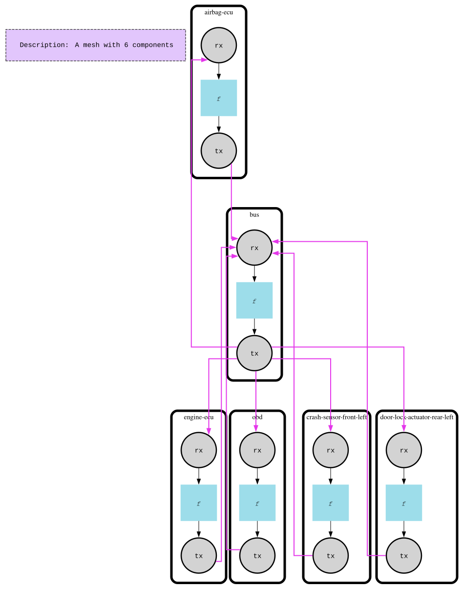

# Basic CAN Bus

This example teaches fan-out: one `bus` component forwards every signal it receives on its single input port out to every component connected to its output port, unchanged. There's no addressing logic in the bus itself — each connected ECU is responsible for filtering out frames that aren't its own.

The scenario is a simplified automotive CAN network. A stream of CAN frames — some well-formed, some corrupted — is injected onto the bus one at a time. The bus rebroadcasts each frame to five ECUs (engine, airbag, a front-left crash sensor, a rear-left door lock actuator, and an OBD diagnostics node); each ECU accepts only frames matching its own ID and reports invalid payloads as corrupted signals. A full-protocol version — with ISO-TP, arbitration, and diagnostics — lives in [`../advanced`](../advanced).

## How it works

- **`bus`** — one input port (`rx`), one output port (`tx`). Its activation function is a single call to `port.ForwardSignals`, copying every signal from `rx` to `tx` with no inspection or filtering.
- **ECUs** (`engine-ecu`, `airbag-ecu`, `crash-sensor-front-left`, `door-lock-actuator-rear-left`, `obd`) — each has its own `rx`/`tx` ports and an integer ID stored via `component.WithInitialState`. Each is piped bus→ECU (`tx`→`rx`) and ECU→bus (`tx`→`rx`), so the bus's output port fans out to all five, and their outputs fan back into the bus's single input.
- On activation, an ECU inspects every signal on `rx`: a payload that isn't a `CanFrame` is logged and re-emitted as a corrupted-signal frame with ID `4` (which the `obd` node, ID `4`, picks up on the next run); a `CanFrame` whose ID doesn't match the ECU's own ID is silently ignored; a match is processed and logged.
- The driving loop injects one signal per run cycle directly onto the bus's `rx` port with `PutSignals`, then calls `fm.Run` — showcasing indexed fan-out/fan-in piping (`OutputByName(...).PipeTo(...)`), per-component state (`component.WithInitialState`, `this.State().Get(...)`), and the `port.ForwardSignals` helper for pass-through components.



## Run

```bash
go run .

# Regenerate can_bus_sim_v0-graph.dot / .svg
FMESH_GRAPH=1 go run .
```
