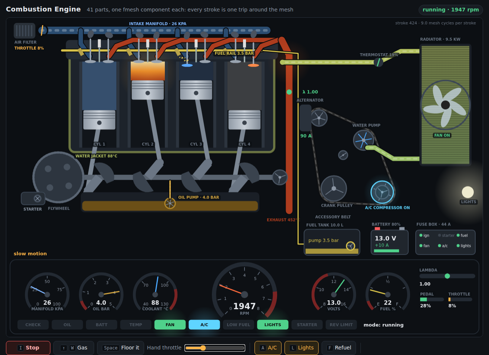

# Internal Combustion Engine

A four-cylinder petrol engine, part by part, that you drive from a browser. **41 components**, one per part: the valves, the injectors, the camshaft and the crankshaft, the oil pump, the water pump, the thermostat, the radiator and its fan, the alternator, the battery, the fuse box, the AC compressor and the rest. Each keeps its own physics in its `State()`, and each is wired to the others the way the real parts are.



```bash
go run .
# then open http://localhost:8080
```

Hold <kbd>↑</kbd> or <kbd>W</kbd> to press the pedal (it springs back when you let go), <kbd>Space</kbd> to floor it, <kbd>I</kbd> to start and stop. <kbd>A</kbd> switches the AC, <kbd>L</kbd> the headlights, <kbd>F</kbd> refuels, <kbd>1</kbd> <kbd>2</kbd> <kbd>3</kbd> set the speed of time (slow motion shows every stroke), <kbd>M</kbd> turns the sound on. Every control is also a button, and the hand throttle slider works on a phone.

Things to try:

- Start it cold and watch the fast idle, the rich mixture and the oxygen sensor waking up as the exhaust heats; the thermostat opens near 86 °C.
- Rev it: the throttle plate opens, the manifold pressure rises, the exhaust glows, the rev limiter cuts in at 6500 rpm. Lift off and the fuel is cut until it nears idle.
- Switch on the AC and the headlights: the ECU raises the idle, the compressor drags on the belt, the fan comes on for the condenser, and the battery starts to discharge at idle until you rev it.
- `go run . -battery 5`: the starter's relay clicks, the battery sags below what the starter needs, nothing turns, and the mesh stops on the first stroke.
- `go run . -fuel 0.05 -coolant 95`: hot from the start, and it runs out of fuel soon.

## How it works

**One trip around the mesh is one stroke**, half a turn of the crankshaft, and nobody drives it from outside. The crankshaft announces the stroke; that is what makes every other part act; the cylinders, the starter and everything that drags on the engine answer with torque; the crankshaft sums it and announces the next stroke. When it stops turning it announces nothing, and the mesh stops by itself: key off, tank dry, stalled or a flat battery all end `Run` with `nil`.

Every flow of a real engine is a flow through the mesh:

| Flow | Path |
|------|------|
| Rotation | `crankshaft` → `camshaft`, `accessory-belt` → `alternator`, `water-pump`, `ac-compressor`; `oil-pump` |
| Air | `air-filter` → `throttle-body` → `intake-manifold` → `intake-valve-N` → `cylinder-N` |
| Fuel | `ecu` → `fuel-tank` → `fuel-pump` → `fuel-rail` → injector N → `cylinder-N` |
| Spark | `ecu` → `ignition-coil` → `cylinder-N` |
| Exhaust | `cylinder-N` → `exhaust-valve-N` → `exhaust-manifold` → `lambda-sensor` → `ecu` |
| Current | `ecu`, `cockpit` switch relays → `fuse-box` → load → `battery` → volts → `fuse-box` → each circuit |
| Heat | `cylinder-N` → `engine-block` → `thermostat` → `radiator` → back to the `engine-block`; `cooling-fan` and the AC condenser → `radiator` |
| Oil | `oil-pump` → `crankshaft` bearings, `oil-pressure-sensor` |
| Torque | `starter`, `cylinder-N`, `oil-pump`, `accessory-belt` → `crankshaft` |

The fmesh ideas it shows:

- **A feedback loop is the clock.** No ticker and no loop in `main`: the crankshaft's output starts the next stroke, and how long a stroke lasts in simulated time follows from the engine's own speed.
- **Flows of different lengths meet in the right stroke.** A part that needs several things every stroke waits for all of them with `component.RequireInputs`: a cylinder waits for air from its valve, fuel from its injector and a spark from the coil, which travel paths of different lengths; the crankshaft waits for the torque of all seven sources.
- **Waiting versus listening.** Sensors report late in a stroke, so the ECU does not wait for them: it keeps the latest reading of each in its state (a small `listen` helper) and decides on the last measurement, like a real ECU. The instrument cluster only listens.
- **Two beats in one component.** The accessory belt drives the accessories, then sums their drag; the fuse box tells the battery the load, then powers each circuit with the voltage that comes back. One component, two flows, no extra plumbing.
- **Indexed ports** (`intake1..4`, `injector1..4`, `spark1..4`) for the per-cylinder outputs of the camshaft, the fuel rail and the coil.
- **The outside world comes in through one component.** The browser only changes a `Driver` (pedal and switches, behind a mutex); the `cockpit` component reads it once per stroke and sends it on as signals. A mesh-level `AfterCycle` hook paces the run to the wall clock and publishes every part's state to the page as server-sent events; the page draws it on a canvas and never computes the engine itself.

The page is one self-contained HTML file (`web/index.html`, embedded in the binary with `go:embed`) with vanilla JavaScript on an HTML5 canvas: no build step, no libraries, nothing loaded from the internet, so it opens in any browser. The server uses only the standard library. The animation runs between the snapshots at the engine's speed, capped at what the eye can follow; slow motion shows every stroke as the mesh computes it.


## Run

```bash
go run .                         # http://localhost:8080
go run . -addr :9000             # somewhere else
go run . -battery 5              # a flat battery
go run . -fuel 0.05 -coolant 95  # nearly empty, already hot

# Regenerate the graph files (combustion engine-graph.dot / .svg)
FMESH_GRAPH=1 go run .
```
