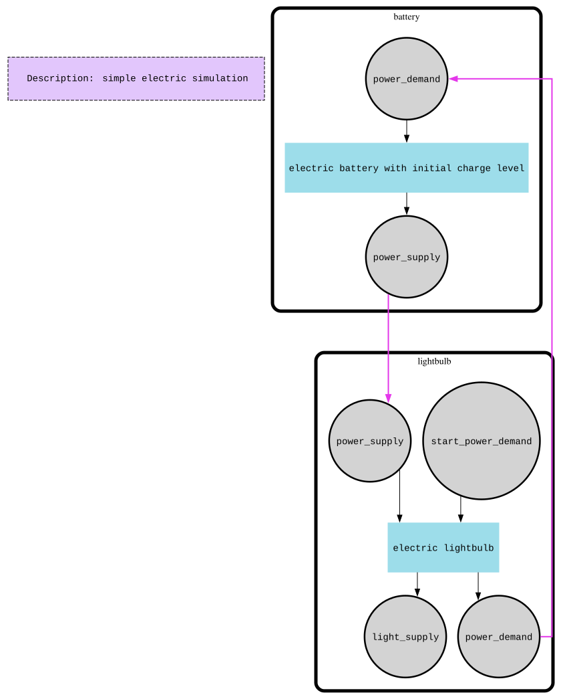

# Electric Circuit

This example demonstrates a supply/demand feedback loop with degrading state: two components pipe signals back and forth, each cycle nudging a piece of internal state until a threshold is crossed and the loop stops feeding itself.

The scenario is a battery powering a lightbulb. Each cycle the lightbulb demands power, the battery supplies what it can (draining its charge), and the lightbulb converts the supplied power into light — heating up a little in the process. If the bulb's temperature exceeds its max working temperature it burns out; if the battery runs out of charge first, it dies. Either way the simulation ends.

## How it works

- **`battery`** — input `power_demand`, output `power_supply`. State: `level` (starts at `1000`). On each activation it reads the demanded current, supplies `min(level, demand)` on `power_supply`, and decrements `level` by whatever it supplied. Logs `LOW BATTERY` when it can't meet demand, `BATTERY DIED` when `level` reaches `0`.
- **`lightbulb`** — inputs `power_supply`, `start_power_demand`; outputs `light_supply`, `power_demand`. State: `temperature` (starts at `26.0°C`). On each activation (after the initial `start_power_demand` kick) it reads the incoming power; if it's enough (`>= 22`), it emits light on `light_supply` and raises `temperature` by a fixed amount per cycle. Above `30°C` light output degrades (`OVERHEATING`); above `50°C` it logs `BURNOUT` and stops emitting light. If supplied power is insufficient it logs `POWER STARVATION`. Every activation ends by requesting the next cycle's power on `power_demand`.
- **Feedback loop**: `battery.power_supply → lightbulb.power_supply` and `lightbulb.power_demand → battery.power_demand`, wired with `PipeTo`. The mesh is seeded once with a `start` signal on `lightbulb.start_power_demand`, which kicks off the first `power_demand` without waiting for a supply.
- **State degrades over cycles**, not within a cycle: `battery.level` only falls, `lightbulb.temperature` only rises, each activation mutating state read at the start of the function and written back via `defer`.
- **Termination**: once the bulb hits `BURNOUT` it stops putting further demand on its output, and once the battery hits `0` it stops supplying — either way no more signals cross the pipes, so `fm.Run()` returns.

Notable APIs: `component.WithInitialState` / `this.State().Get`/`Set` for per-component state, `fmesh.WithErrorHandlingStrategy(fmesh.StopOnFirstErrorOrPanic)` on the mesh, and `Signals().FirstPayloadOrDefault(0)` for reading a possibly-absent input.



## Run

```bash
go run .

# Regenerate battery_and_lightbulb-graph.dot / .svg
FMESH_GRAPH=1 go run .
```
