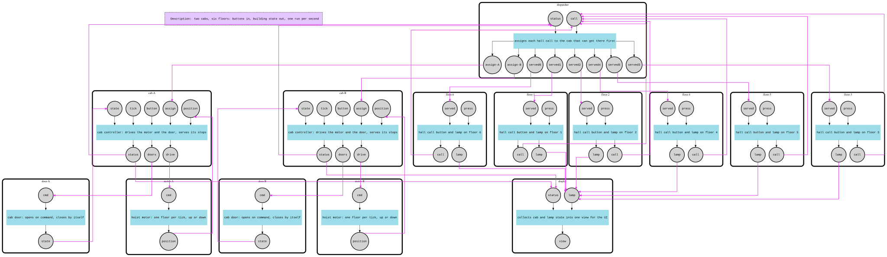

# Elevator

Two elevators in a six-floor building, and a terminal UI that talks to the mesh both ways: **button presses go in as signals, and the state of the building comes back out as a signal** that the UI draws.

```
second 10  2 4
       A     B   call
  6 │     │  ·  │
  5 │     │ [▲] │
  4 │ [▼] │  ·  │  ●
  3 │     │     │
  2 │  ·  │     │  ●
  1 │  ·  │     │
```

A cab is `[▲]`/`[▼]` while moving, `[■]` when idle and `[ ]` with its doors open; a dot is a floor it will stop at, and `●` is a lit call lamp.

## How it works

14 components, each a real part of the building:

| Component | What it does |
|-----------|--------------|
| `floor-1` … `floor-6` | The call button and lamp on each landing. A press lights the lamp and sends a call; `served` puts it out. |
| `dispatcher` | Gives every call to the cab that can get there first (distance, how busy it is, whether it is heading away), and tells a floor when a cab has opened its doors there. |
| `cab-A`, `cab-B` | The cab controllers. On every tick they decide: open the doors, move, or wait, and keep going in one direction while there are stops ahead, as real elevators do. |
| `motor-A`, `motor-B` | Move their cab one floor per tick and report where it is. |
| `door-A`, `door-B` | Open on command and close by themselves a few ticks later. |
| `display` | Gathers every cab's status and every lamp into one `View`: the way state leaves the mesh. |

- **The UI drives time, the mesh is the building.** Every `Run` is one second: the UI puts a `tick` on each cab, plus whatever was pressed (`press` on a floor, `button` inside a cab), runs the mesh and draws the `View` it finds on the display's output. Components keep their `State()` between runs, so nothing in `main` knows where the cabs are.
- **Feedback loops everywhere.** Each cab commands its motor and door and listens to what they report; cabs report to the dispatcher, which assigns them new stops; the dispatcher turns a cab's arrival into a lamp going off on a floor.
- **A controller listens all the time but acts once per tick.** Position, door state and new stops can arrive in any cycle of the run and are only recorded; the decision is taken when the tick arrives, so each second moves a cab at most one floor.
- Notable APIs: `component.WithIndexedOutputs` for the dispatcher's `served1..served6`, `port.MultiPipe` for the wiring, typed payloads read with `sig.As[CabStatus]()`, and re-running one mesh many times.



## Run

```bash
# Interactive: type a floor (1-6) to call a cab, a1-a6 / b1-b6 to ride one, q to quit
go run .

# A scripted rush hour (also what you get when stdin is not a terminal)
go run . -demo

# Regenerate the graph files (elevator-graph.dot / .svg)
FMESH_GRAPH=1 go run .
```
