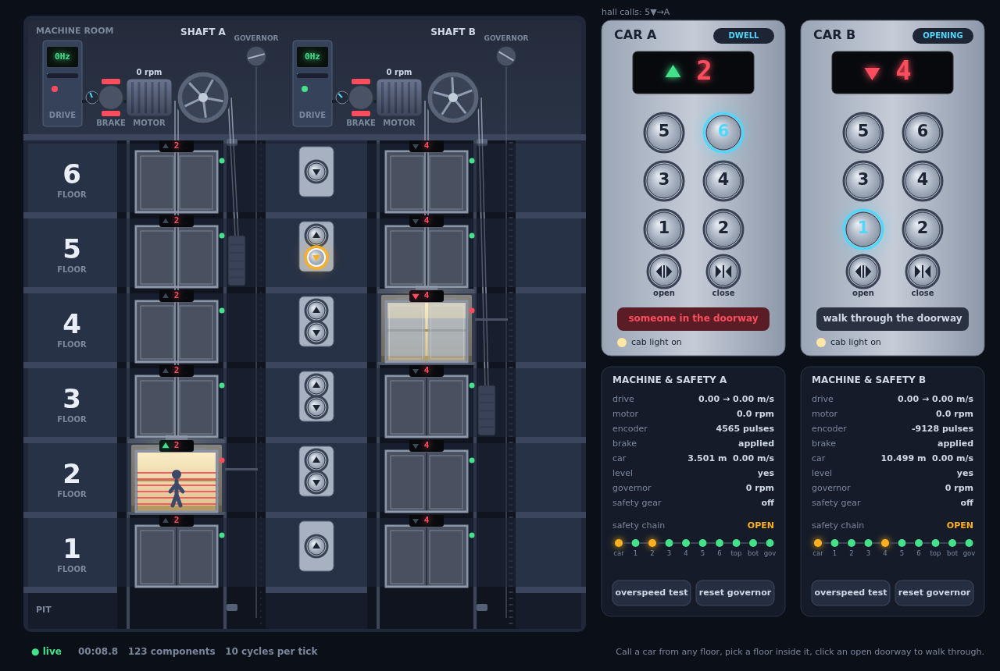

# Elevator

Two elevators in a six-floor building, built from **every part a real installation has**: 123 components. You play it in the browser: call a car from any landing, pick a floor inside it, walk through a closing door, run the governor's overspeed test. Every click goes into the mesh as a signal on a button, and the page only draws what the parts report back.



## Run

```bash
go run .          # then open http://localhost:8080
go run . -demo    # visitors press buttons on their own

# Regenerate the graph files (elevator-graph.dot / .svg)
FMESH_GRAPH=1 go run .
```

The page is one HTML file with plain JavaScript on a canvas, embedded in the binary: no build step, nothing fetched from the internet. The Go side uses only the standard library: server-sent events stream the frames out, plain `POST /press` brings the clicks in.

## The parts

| Where | Components |
|-------|------------|
| Every landing | `hall-up-N`, `hall-down-N` call buttons and their LEDs `hall-up-led-N`, `hall-down-led-N` |
| Every landing of each shaft | `landing-door-X-N`, which the car door drags open, its interlock `door-lock-X-N`, and the `lantern-X-N` above it |
| Inside each car | `car-X-button-1` … `6` and their LEDs, `car-X-open`, `car-X-close`, `car-X-display`, `car-X-light` |
| Each car's doorway | `door-operator-X` (the door motor and the car door contact), `light-curtain-X` |
| Each hoist | `drive-X` → `motor-X` → `sheave-X` → `car-X` and `counterweight-X`, with `brake-X` on the motor shaft, `encoder-X` feeding the drive, `position-sensor-X` reading the car's height, `governor-X` and `safety-gear-X`, final limit switches `limit-top-X`, `limit-bottom-X` |
| Each shaft's safety | `safety-chain-X`: the series circuit through the car door contact, the six door locks, both limit switches and the governor |
| The building | `controller-A`, `controller-B`, the `dispatcher` that hands hall calls to them, the `clock` and the `panel` |

## How it works

- **One run is 50 ms of the building's life.** The UI loop puts one pulse into the `clock`, which fans a tick out to both controllers and both light curtains. The tick ripples through the hoist as a wave, one part per cycle: the controller asks the drive for a speed, the drive ramps the motor, the motor turns the encoder and the sheave, the sheave moves the car and the counterweight, the car moves past the position sensor, the governor and the limit switches. Ten cycles later the mesh is quiet and the run is over.
- **Each part acts on one input and only remembers the rest.** The motor moves when the drive powers it and remembers whether the brake is released; the drive ramps when the controller asks and remembers what the encoder and the safety chain said. That is why a tick moves everything exactly once, however many cycles it takes to settle, and why feedback loops (drive ↔ encoder, controller ↔ door operator, controller ↔ dispatcher) never run away.
- **Safety is wiring, not code.** No `if door open then stop` lives in the controller. Every door lock, the car door contact, the limit switches and the governor pipe into the safety chain; the chain pipes into the drive and the brake, which cut power the moment it opens. Press *overspeed test* while a car runs: the drive overspeeds, the governor trips, the safety gear grips the rails and the chain stops everything, until you press *reset governor*.
- **Mechanics talk to each other directly.** The car door drags the landing door at whatever floor the car stands, and that door's lock reports to the chain: the controller never touches a landing door.
- **Buttons and their LEDs are separate parts**, as in a real panel: a button only says it was pressed; the controller or the dispatcher decides when its LED lights and goes out.
- **State leaves the mesh through one component.** Every part with something to show (all but the buttons) has a `telemetry` output: 96 pipes into the `panel`, which merges them into one frame: the fan-in the page draws.
- Notable APIs: `component.WithIndexedOutputs` for the LEDs (`led1`…`led6`, `led-up1`…), one output piped to many inputs (the car's position to its sensors, its governor and six landing doors), `fmesh.WithCyclesHistoryLimit(1)` for a mesh that runs forever, components keeping their `State()` across runs, typed payloads read with `sig.As[Contact]()`.


