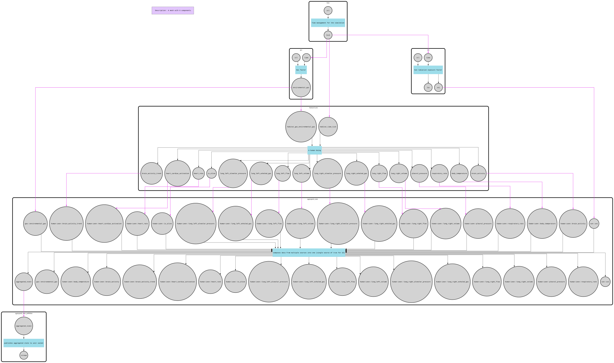
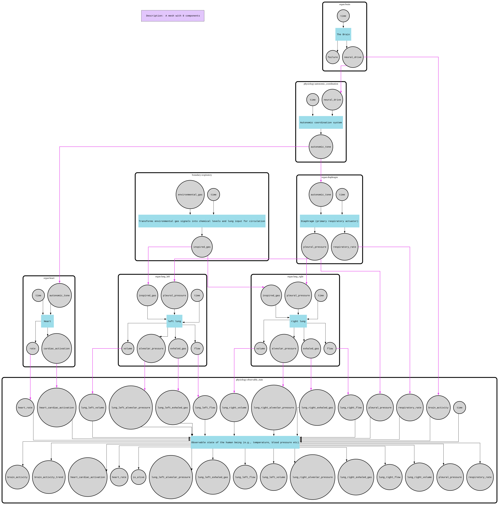

# Life

A step simulation of human physiology inside a habitat, built on [F-Mesh](https://github.com/hovsep/fmesh). A human — Leon — lives in a world made of time, air and sun. Commands typed at a console (or the built-in dashboard) feed him, work him, frighten him, poison the air he breathes and open his wounds, and the body answers with the mechanisms a physiology course teaches: the baroreflex defends blood pressure, the chemoreflex sets how hard he breathes, the pancreas and liver argue over blood sugar, the adrenal glands answer a stressor on two clocks, and when a reservoir runs dangerously low the organs that depend on it are injured in a recognisable order — up to and including death.

It is written for students and teachers of biology and physiology as much as for people learning F-Mesh. The constants are derived from textbook values rather than tuned by feel — the alveolar gas equation, the oxyhemoglobin dissociation curve, hormone half-lives, the ATLS haemorrhage classes — and a suite of reference tests holds the model to figures a physiologist can look up. Where the model deliberately simplifies (game-pace collapse, no metabolic acid–base), the code says so.

As an F-Mesh example it demonstrates three things. **Composition**: the body is a mesh of ~26 components (organs, controllers, distributed anatomy, physiology hubs) wrapped as a single component living inside the habitat mesh; all communication is signal-based and no component shares mutable state with another. **Cross-cutting behavior as plugins**: any organ becomes damageable, blood-supplied or hormone-sensitive by attaching the `damage`, `perfusion` or `receptor` plugin — no per-organ code. **Extension and replacement seams**: reactions at every level, from mechanical injury (`trauma:bleed`) to hormonal (adrenaline, cortisol, insulin, glucagon), reach the body through generic wiring — a shared blood bus, auto-wired ticks, a telemetry catalog — so adding an organ or a metric is a declaration, not a rewiring; and the environment is a constructor parameter (`getSimulationMeshIn` in `mesh.go`), so anything that publishes breathable gas under the name `air` is a world this body can live in. The lungs likewise follow whichever pleural-pressure source pulls hardest, which is the seam a ventilator would drop into. Today the one environment is the atmosphere, but it can already be commanded into chamber-like states (`air:preset hyperbaric`, `air:pressure`, `altitude`).

## Architecture

```
life/
├── main.go, mesh.go         # entry point, mesh assembly, command registration
├── env/                     # habitat mesh + telemetry aggregation/publishing
│   └── factor/              # the world: time, air (pressure, mixture, mixins), sun
├── organism/human/          # the body
│   ├── human_component.go   # the body as one component: sense → act → feedback
│   ├── human_mesh.go        # the inner mesh: all organs and their wiring
│   ├── organ/               # brain, heart, lungs, diaphragm, kidney, liver, pancreas, adrenal
│   ├── distributed_anatomy/ # tissues that are everywhere: blood, vasculature, GI, skin, muscle
│   ├── boundary/            # where world meets body: airway, ingestion
│   ├── controller/          # command surface: intake, activity, emotion, excretion, trauma
│   └── physiology/          # reflexes, reservoirs, damage engine, affect, observable state
├── plugin/                  # reusable organ plugins: damage, perfusion, receptor
├── atmosphere/, bloodstream/, body/, autonomic/  # vocabulary: signal formats and derived constants
├── telemetry/               # the catalog: single source of truth for everything published
├── tui/                     # the integrated dashboard — see ./tui/README.md
└── *_test.go                # wiring checks, physiology reference tests, command-effect and death scenarios
```

Start with `main.go` for the simulation model, then `organism/human/human_mesh.go` to see how the body is composed and wired; the organ files each explain the physiology they implement. The dashboard is documented separately in [`./tui/README.md`](./tui/README.md).

The simulation itself runs on the shared [`../sim`](../sim) library: `stepsim` advances the mesh in fixed steps of simulated time, `session` paces it and drives it with commands, `simtest` runs scenarios in tests, and `simtime`/`command`/`mathx` supply the plumbing.

## How a tick works

Time is discrete: each mesh run represents 10 ms of simulated time (`factor.DefaultTickDuration` — a display decision, fine enough that the ECG's R-peaks don't alias). The step is recorded on the mesh itself, so the engine and the time component cannot disagree about it.

Each step:

1. A `BeforeRun` hook injects a tick into the habitat's `time` component; the `stepsim` engine runs the mesh once per step, and the session paces it — one simulated second per wall-clock second by default (`rate:sim` changes that).
2. The habitat is forward-predictive: each factor (air, sun) activates on the tick and computes its next state. Wiring is by convention, not by hand: a component with an input named `time` gets the clock, and one with an input named `habitat_<factor>_<port>` gets that factor's output — which is how an organism asks the world for exactly the parts it cares about.
3. The human is reactive. Its activation is staged: **sense** fans the tick to every inner component that keeps time and forwards air to the airway and skin (and sunlight to the skin); **route** delivers any pending commands to the controller that owns each namespace; **act** runs the inner human mesh until it converges, activating every organ; **feedback** forwards everything in the telemetry catalog back out through the component's ports.

Inside a run, signals travel over several mesh cycles, so a component may activate more than once per tick. The organs therefore split their work: time-based behavior (decay, aging, secretion) runs only when the tick is present, and integration runs as signals arrive. Components that sit inside feedback loops — the blood, the vasculature, the reservoirs — publish their current state on the tick *before* folding in this tick's inputs, so the baroreflex and the glucose loop react to a value that was real one tick ago and the mesh cannot deadlock on its own cycles.

The feedback loop from human back to habitat is intentionally omitted: the simulation is single-directional (habitat → human), because the subject is human physiology rather than environmental dynamics.

The two meshes, as generated by `FMESH_GRAPH=1`:





## Run

```bash
cd simulation/life

go run .            # dashboard + command prompt (the default)
go run . --plain    # plain REPL, no dashboard

# Headless scripting: piped stdin implies --plain behavior
printf 'activity:start 3\ntime:now\nexit\n' | go run . --plain

# Regenerate the mesh graphs (requires graphviz)
FMESH_GRAPH=1 go run .
```

`--plain` is the only flag; `FMESH_GRAPH=1` is the only environment variable. Type `help` at the prompt for the full command list: session commands (`pause`, `resume`, `step`, `rate:sim`, scheduling), environment commands (`temp:hot`, `sun:hour`, `altitude 5500`, `air:preset hyperbaric`, `air:mixin wood_fire 30m`, `smoke:cigarette`, `air:co 800`, `air:oxygen 100`...) and body commands (`intake:water 500ml`, `intake:food 200kcal`, `activity:start 8 30m`, `trauma:bleed 1500ml`, `emotion:stimulus 0.8 -0.5`, `excretion:urinate`...).

The test suite simulates hours of physiology and is by far the longest in the repository:

```bash
go test ./simulation/life/...          # full suite: ~15 minutes
go test -short ./simulation/life/...   # skips the multi-minute physiological runs
```
